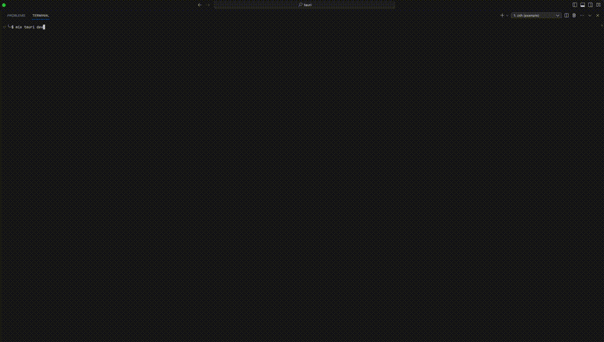

# ExTauri

**Build native desktop applications with Phoenix and Elixir.**

ExTauri wraps [Tauri](https://tauri.app) to enable Phoenix LiveView applications to run as native desktop apps on macOS, Windows, and Linux.



## Features

- **Phoenix LiveView as Desktop Apps** — Turn your Phoenix app into a native desktop application
- **Single Binary Distribution** — Uses [Burrito](https://github.com/burrito-elixir/burrito) to bundle everything into one executable
- **Hot Reload in Dev Mode** — Full Phoenix development experience with live reload
- **Graceful Shutdown** — Heartbeat-based mechanism ensures clean shutdown on CMD+Q, crashes, or force-quit
- **Automated Setup** — Uses [Igniter](https://hexdocs.pm/igniter) for safe, AST-aware project configuration
- **Cross-Platform** — Build for macOS, Windows, and Linux

## Prerequisites

- **Elixir** >= 1.15 with OTP 27
- **Rust** — [Install via rustup](https://www.rust-lang.org/tools/install)
- **Platform dependencies** — see [Tauri prerequisites](https://v2.tauri.app/start/prerequisites/)

> **Note:** Zig is only required if you use Burrito for cross-compilation. For same-platform builds, Rust alone is sufficient.

## Getting Started

### 1. Add ExTauri to your Phoenix project

```elixir
# mix.exs
def deps do
  [
    {:ex_tauri, git: "https://github.com/filipecabaco/ex_tauri.git"}
  ]
end
```

### 2. Configure ExTauri

```elixir
# config/config.exs
config :ex_tauri,
  version: "2.5.1",
  app_name: "My Desktop App",
  host: "localhost",
  port: 4000
```

### 3. Install and set up

```bash
mix deps.get
mix ex_tauri.install
```

`mix ex_tauri.install` automatically:
- Installs the Tauri CLI via Cargo
- Scaffolds the `src-tauri/` project structure (Rust, config, capabilities)
- Adds `ExTauri.ShutdownManager` to your supervision tree
- Adds a `:desktop` release to your `mix.exs`
- Generates a LiveView JS hook for Tauri communication

### 4. Wire up the LiveView hook

Add the hook to your LiveView JS:

```javascript
// assets/js/app.js
import { TauriHook } from "../vendor/ex_tauri"

let liveSocket = new LiveSocket("/live", Socket, {
  hooks: { TauriHook },
})
```

Add the hook element to your root layout (e.g. `root.html.heex`):

```html
<div id="tauri-bridge" phx-hook="TauriHook"></div>
```

### 5. Run in development

```bash
mix ex_tauri.dev
```

This starts your Phoenix app as a native desktop window with full hot-reload support.

## Building for Production

### 1. Add Burrito wrapping

Update the `:desktop` release in your `mix.exs` to include Burrito:

```elixir
# mix.exs
def project do
  [
    # ... existing config
    releases: [
      desktop: [
        steps: [:assemble, &Burrito.wrap/1],
        burrito: [
          targets: [
            "aarch64-apple-darwin": [os: :darwin, cpu: :aarch64]
          ]
        ]
      ]
    ]
  ]
end
```

### 2. Add required applications

```elixir
# mix.exs
def application do
  [
    mod: {MyApp.Application, []},
    extra_applications: [:logger, :runtime_tools, :inets]
  ]
end
```

### 3. Build

```bash
mix ex_tauri.build
```

Your app bundle will be at `src-tauri/target/release/bundle/` with platform-specific packages:
- **macOS:** `.app` and `.dmg`
- **Linux:** `.deb` and `.appimage`
- **Windows:** `.msi` and `.exe`

## Mix Tasks

| Task | Description |
|------|-------------|
| `mix ex_tauri.install` | Set up Tauri in your project (one-time) |
| `mix ex_tauri.dev` | Run in development mode with hot-reload |
| `mix ex_tauri.build` | Build for production |
| `mix ex_tauri.info` | Show Tauri project and environment info |
| `mix ex_tauri.icon` | Generate app icons from a source image |
| `mix ex_tauri.signer` | Manage code signing for updates |

Run `mix help ex_tauri.<task>` for detailed options.

## How It Works

### Architecture

```
┌─────────────────────┐
│   Tauri Window       │  Native window (Rust/WebView)
│   ┌───────────────┐  │
│   │  Phoenix UI   │  │  Your LiveView app rendered in WebView
│   └───────────────┘  │
└─────────┬────────────┘
          │
          │  HTTP — serves your Phoenix UI to the WebView
          │  Unix Socket — heartbeat for lifecycle management
          │
┌─────────┴────────────┐
│   Phoenix Server     │  Your Elixir app (Burrito-wrapped sidecar)
│   (Sidecar Process)  │
└──────────────────────┘
```

Tauri launches your Phoenix app as a **sidecar process**. The WebView connects to Phoenix over HTTP to render your LiveView UI. A separate Unix domain socket carries heartbeat signals for lifecycle management.

### Heartbeat-Based Shutdown

ExTauri uses a Unix domain socket heartbeat to detect when the Tauri frontend exits:

1. `ShutdownManager` creates a socket at `<tmpdir>/tauri_heartbeat_<app_name>.sock`
2. The Rust frontend connects and sends a byte every **100ms**
3. `ShutdownManager` checks for heartbeats every **500ms**
4. If no heartbeat is received for **1500ms**, graceful shutdown begins
5. Phoenix closes connections, flushes logs, and exits cleanly

This works even when the app is force-quit, crashes, or is killed unexpectedly. The socket path is unique per application (based on `:app_name`) to prevent collisions.

## Configuration

### Core Settings

```elixir
# config/config.exs
config :ex_tauri,
  version: "2.5.1",           # Tauri version (default: latest)
  app_name: "My App",         # Application name (required)
  host: "localhost",          # Phoenix host (required)
  port: 4000                  # Phoenix port (required)
```

### Window Settings

```elixir
config :ex_tauri,
  window_title: "My Window",  # Window title (defaults to app_name)
  fullscreen: false,          # Start in fullscreen
  width: 800,                 # Window width
  height: 600,                # Window height
  resize: true                # Allow window resize
```

### Advanced Settings

```elixir
config :ex_tauri,
  heartbeat_interval: 500,    # How often to check heartbeat (ms)
  heartbeat_timeout: 1500,    # Time without heartbeat before shutdown (ms)
  scheme: "http"              # URL scheme (http or https)
```

## Troubleshooting

### Rust/Cargo not found

```
Rust/Cargo is not installed or not in your PATH.
```

Install Rust via [rustup](https://www.rust-lang.org/tools/install):
```bash
curl --proto '=https' --tlsv1.2 -sSf https://sh.rustup.rs | sh
```

### Database configuration for desktop apps

Desktop apps need a local database path. Configure in `config/runtime.exs`:

```elixir
database_path =
  System.get_env("DATABASE_PATH") ||
    Path.join([System.user_home!(), ".my_app", "my_app.db"])

File.mkdir_p!(Path.dirname(database_path))

config :my_app, MyApp.Repo,
  database: database_path,
  pool_size: 5
```

### Static assets in production

Remove or comment out `cache_static_manifest` in `config/prod.exs` if you don't use `mix assets.deploy`:

```elixir
# config :my_app, MyAppWeb.Endpoint,
#   cache_static_manifest: "priv/static/cache_manifest.json"
```

### DMG build permission error (macOS)

```
execution error: Not authorised to send Apple events to Finder. (-1743)
```

Grant automation permissions: **System Settings** > **Privacy & Security** > **Automation** > enable **Finder** for your terminal app.

### Port already in use

If `mix ex_tauri.dev` hangs, check if another process is using the configured port:

```bash
lsof -i :4000
```

Kill the process or change the `:port` in your ExTauri config.

## Example

See the [example/](example/) directory for a complete working Phoenix desktop app with SQLite, LiveView, and Tailwind CSS.

## Acknowledgements

- [Tauri App](https://tauri.app) — For the amazing framework
- [Burrito](https://github.com/burrito-elixir/burrito) by Digit/Doawoo — For single-binary Elixir apps
- [Igniter](https://hexdocs.pm/igniter) — For safe, AST-aware code patching
- [phx_new_desktop](https://github.com/feng19/phx_new_desktop) by Kevin Pan/Feng19 — For inspiration

## License

MIT
